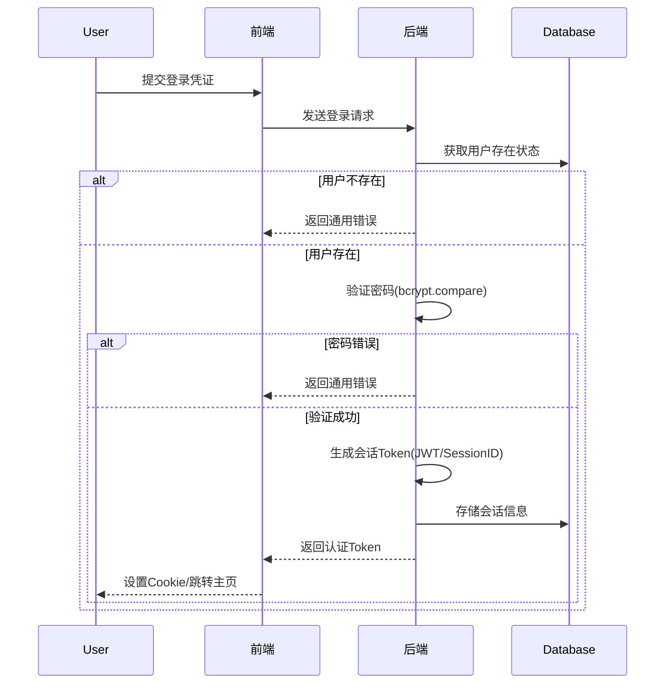

```mermaid
sequenceDiagram
    participant User
    participant 前端
    participant 后端
    participant Database

    User->>前端: 提交登录凭证
    前端->>后端: 发送登录请求
    后端->>Database: 获取用户存在状态
    alt 用户不存在
        后端-->>前端: 返回通用错误
    else 用户存在
        后端->>后端: 验证密码(bcrypt.compare)
        alt 密码错误
            后端-->>前端: 返回通用错误
        else 验证成功
            后端->>后端: 生成会话Token(JWT/SessionID)
            后端->>Database: 存储会话信息
            后端-->>前端: 返回认证Token
            前端-->>User: 设置Cookie/跳转主页
        end
    end
```
用户的sessionId数据库表：
