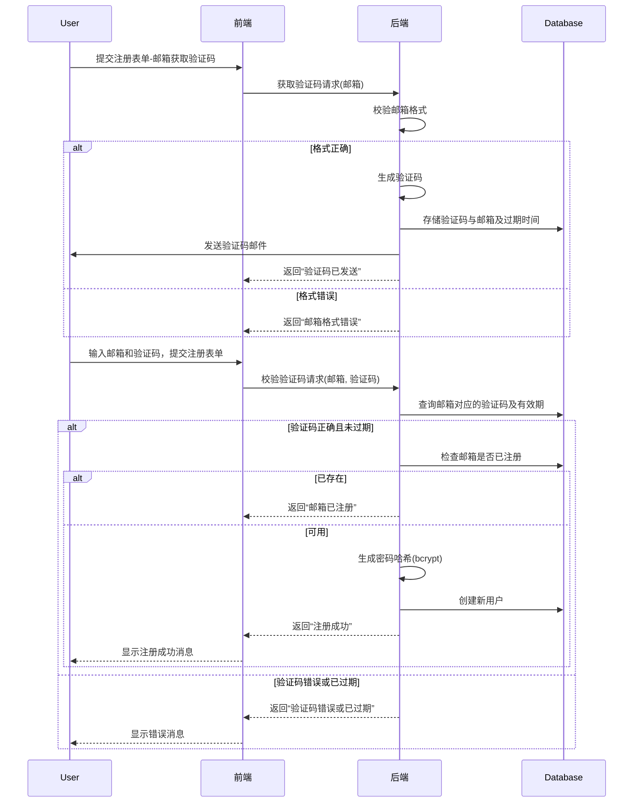

```mermaid
sequenceDiagram
participant User
participant 前端
participant 后端
participant Database

    User->>前端: 提交注册表单-邮箱获取验证码
    前端->>后端: 获取验证码请求(邮箱)
    后端->>后端: 校验邮箱格式
    alt 格式正确
        后端->>后端: 生成验证码
        后端->>Database: 存储验证码与邮箱及过期时间
        后端->>User: 发送验证码邮件
        后端-->>前端: 返回“验证码已发送”
    else 格式错误
        后端-->>前端: 返回“邮箱格式错误”
    end

    User->>前端: 输入邮箱和验证码，提交注册表单
    前端->>后端: 校验验证码请求(邮箱, 验证码)
    后端->>Database: 查询邮箱对应的验证码及有效期
    alt 验证码正确且未过期
        后端->>Database: 检查邮箱是否已注册
        alt 已存在
            后端-->>前端: 返回“邮箱已注册”
        else 可用
            后端->>后端: 生成密码哈希(bcrypt)
            后端->>Database: 创建新用户
            后端-->>前端: 返回“注册成功”
            前端-->>User: 显示注册成功消息
        end
    else 验证码错误或已过期
        后端-->>前端: 返回“验证码错误或已过期”
        前端-->>User: 显示错误消息
    end
```