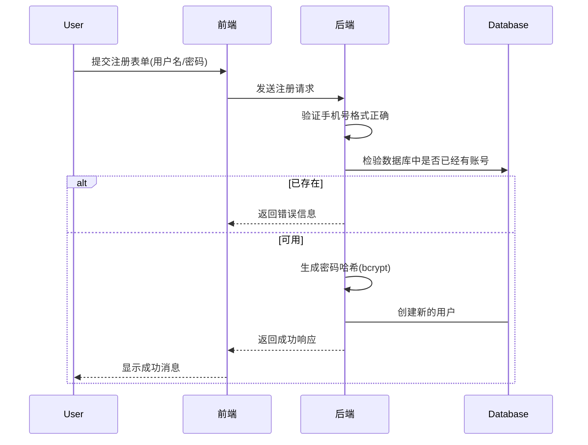

```mermaid
sequenceDiagram
    participant User
    participant 前端
    participant 后端
    participant Database
    
    User->>前端: 提交注册表单(用户名/密码)
    前端->>后端: 发送注册请求
    后端->>后端: 验证手机号格式正确
    后端->>Database: 检验数据库中是否已经有账号
    alt 已存在
        后端-->>前端: 返回错误信息
    else 可用
        后端->>后端: 生成密码哈希(bcrypt)
        后端->Database: 创建新的用户
        后端-->>前端: 返回成功响应
        前端-->>User: 显示成功消息
    end
```